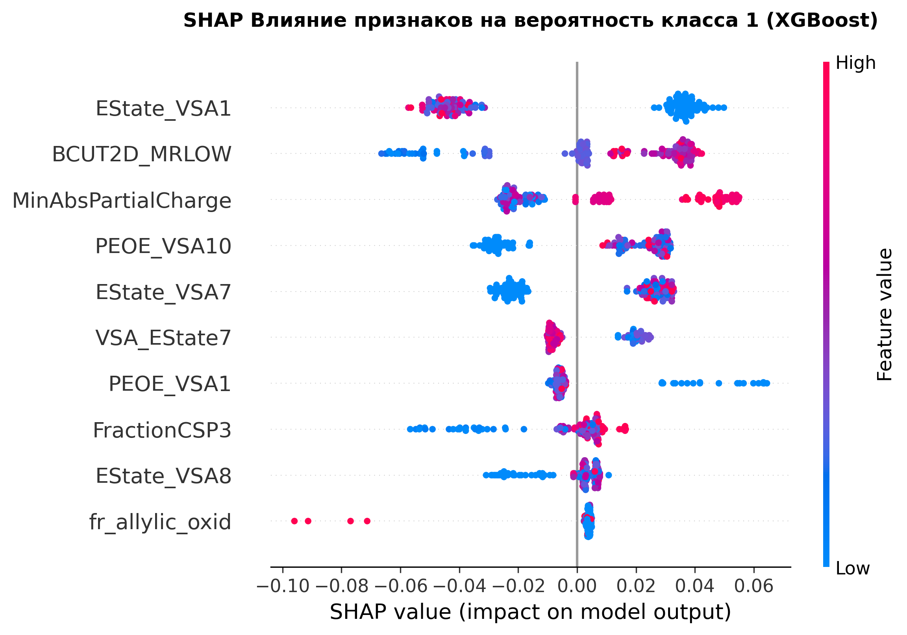

# 🔬 Финальный аналитический отчёт по проекту QSAR-моделирования

### 📂 Структура проекта
* [01_EDA_and_Preprocessing.ipynb](./01_eda_and_preprocessing.ipynb) — Разведочный анализ и очистка данных.
* [02_Regression_pIC50.ipynb](./02_regression_pic50.ipynb) — Прогнозирование биологической активности.
* [03_Regression_pCC50.ipynb](./03_regression_pcc50.ipynb) — Прогнозирование цитотоксичности.
* [04_Regression_log10_SI.ipynb](./04_regression_log_si.ipynb) — Прогнозирование селективности.
* [05_Classification_Tasks IC50 median.ipynb](./05_class_ic50_median.ipynb) — Задачи бинарной классификации медианы.
* [06_Classification_Tasks CC50 median.ipynb](./06_class_cc50_median.ipynb) — Задачи бинарной классификации медианы.
* [07_Classification_Tasks SI median.ipynb](./07_class_si_median.ipynb) — Задачи бинарной классификации медианы.
* [08_Classification_Tasks SI above 8.ipynb](./08_class_si_above_8.ipynb) — Задачи бинарной классификации поиска лидеров SI > 8.
 
## 1. Введение и постановка задачи
В рамках данного R&D-проекта была решена задача компьютерного прогнозирования (*in silico*) ключевых фармакологических свойств молекул: биологической активности (`IC50`), цитотоксичности (`CC50`) и индекса селективности (`SI`). 

Качественное решение этих задач имеет стратегическое значение для фармацевтической разработки: точный отбор соединений на этапе компьютерного скрининга позволяет кратно сократить затраты на слепой лабораторный синтез и минимизировать риски провала препарата на стадиях клинических испытаний.

Всего было успешно реализовано **7 изолированных пайплайнов машинного обучения** (3 задачи регрессии и 4 задачи классификации), каждый из которых оформлен в виде отдельного воспроизводимого Jupyter-ноутбука в репозитории проекта.

---

## 2. Результаты этапа предобработки данных (EDA)
Первичный аудит выявил несколько критических проблем в исходных данных, которые были успешно устранены:
1. **Технический брак (Пропуски):** Было обнаружено 3 строки (78, 79, 80) с отсутствующими значениями дескрипторов электронных зарядов и топологии. Строки были удалены, что составило всего **0.3% от выборки** и гарантировало чистоту признакового пространства.
2. **Экспериментальный шум (Дубликаты):** Выявлено **32 полных дубликата** и **196 скрытых дубликатов** (одинаковые молекулы, протестированные в разных тестах с противоречивыми ответами). Полные копии были удалены, а таргеты скрытых дубликатов — корректно усреднены. Это позволило сгладить лабораторный шум и спасти для обучения ~20% датасета. Итоговый датасет составил **802 уникальные строки**.
3. **Асимметрия таргетов:** Из-за экстремального разброса концентраций (от 0 до 4000 мМ) непрерывные таргеты были переведены в логарифмическую шкалу (`pIC50`, `pCC50`, `log10_SI`). Распределения приблизились к нормальному виду, что стабилизировало функции потерь моделей регрессии.
4. **Оптимизация признаков:** Избыточные и маловариативные признаки, а также мультиколлинеарные дескрипторы с парной корреляцией $>0.90$ (например, дублирующие друг друга метрики массы и бензольных колец) были отфильтрованы. Размерность сократилась с 216 до **157 чистых признаков**.

---

## 3. Сводные результаты моделирования

### 📊 Задачи Регрессии (Числовые прогнозы)
Для оценки качества использовался коэффициент детерминации $R^2$ (аналог точности для чисел) и средняя абсолютная ошибка ($MAE$). В пул алгоритмов были добавлены современные бустинги (CatBoost, LightGBM) и базовый случайный маркер (DummyRegressor).

| Задача регрессии | Лучшая модель | $R^2$ (Test) | $MAE$ (Test) | Ключевой инсайт / Вывод |
| :--- | :--- | :---: | :---: | :--- |
| **Сила действия (`pIC50`)** | **RandomForest** | **0.402** | 0.478 | Зависимость строго нелинейная (Бейзлайн Ridge полностью провалился в минус: $-5.95$). Метрика $R^2 \approx 0.40$ — отличный научный стандарт для зашумлённых биологических тестов *in vitro*. |
| **Токсичность (`pCC50`)** | **CatBoost** | **0.447** | 0.369 | **Абсолютный чемпион регрессии.** Симметричные деревья CatBoost точнее всего описали мембранную проницаемость. Сравнение с DummyRegressor ($-0.002$) доказывает адекватность модели. |
| **Селективность (`log10_SI`)**| **CatBoost** | **0.252** | 0.395 | Самая сложная задача. Низкий $R^2$ обоснован тем, что индекс $SI$ — это производная величина ($CC50/IC50$), которая аккумулирует в себе шум сразу двух экспериментов. |

### 🎯 Задачи Классификации (Бинарные прогнозы «Да/Нет»)
Все модели обучались со стратификацией фолдов (`StratifiedKFold`) для сохранения пропорций классов и встроенным взвешиванием для защиты от дисбаланса. Главная метрика оптимизации — $F1\text{-}Score$.

| Задача классификации | Лучшая модель | Accuracy | Precision | Recall | $F1\text{-}Score$ | $ROC\text{-}AUC$ |
| :--- | :--- | :---: | :---: | :---: | :---: | :---: |
| **`IC50 > медианы`** | **RandomForest** | **0.801** | 0.800 | 0.800 | **0.800** | 0.827 |
| **`CC50 > медианы`** | **RandomForest** | **0.733** | 0.740 | 0.712 | **0.726** | 0.817 |
| **`SI > медианы`** | **XGBoost** | **0.677** | 0.679 | 0.662 | **0.671** | 0.729 |
| **`SI > 8` (Поиск лидеров)** | **XGBoost** | **0.696** | 0.544 | 0.574 | **0.559** | 0.724 |

---

## 4. Анализ и обоснование выбора лучших решений

1. **Доминирование древесных ансамблей:** Во всех 7 задачах линейные модели (Ridge-регрессия и Логистическая регрессия) уступили ансамблям деревьев (RandomForest, CatBoost, XGBoost). Это обусловлено хемоинформатической спецификой: биологический ответ формируется за счёт сложных, каскадных нелинейных взаимодействий химических свойств (например, молекула должна одновременно обладать и нужной липофильностью, и конкретным зарядом на атоме азота). Линейная математика такие паттерны уловить не способна.
2. **Почему CatBoost победил в регрессии токсичности (`pCC50`):** Алгоритм CatBoost за счёт робастной схемы построения деревьев проявил устойчивость к экстремальным выбросам, которые мы обнаружили в 139 признаках методом $IQR$. Используемый на этапе предобработки **`RobustScaler`** (масштабирование по медиане) застраховал веса модели от искажений.
3. **Разбор главной задачи скрининга (`SI > 8`):** Модель XGBoost показала здесь лучший компромисс ($F1 \approx 0.56$) в условиях сильного природного дисбаланса классов (целевых молекул-лидеров в базе всего ~22%). 
   * Полнота ($Recall = 57.4\%$) гарантирует, что мы не пропустим больше половины потенциально успешных лекарств.
   * Точность ($Precision = 54.4\%$) означает, что **каждая вторая** отобранная алгоритмом молекула подтвердит свою селективность в реальной лаборатории. Без модели химикам пришлось бы вслепую перебирать тысячи веществ с эффективностью всего 22% (каждая пятая). Модель повышает КПД разработки более чем в 2.5 раза.
   * При этом **RandomForest** в этой же задаче показал самый высокий потенциал ранжирования ($ROC\text{-}AUC = 0.764$, $PR\text{-}AUC = 0.666$). Это делает его отличным альтернативным кандидатом для "мягкого" скрининга, если химики захотят расширить пул тестируемых веществ.

---

## 5. Фармакологическая интерпретация (Инсайты SHAP и Feature Importance)
Благодаря встроенным методам важности признаков и продвинутому **SHAP-анализу** для моделей-победителей, нам удалось извлечь реальные физико-химические правила, которыми руководствуется искусственный интеллект:
* **Фактор водородных связей (`NHOHCount`):** Стал абсолютным лидером значимости для прогноза токсичности клеток ($>5.2\%$). Количество доноров водородных связей (—OH и —NH группы) критически определяет сродство вещества к белкам здоровых клеток.
* **Вектор оптимизации селективности (`fr_Imine`):** SHAP-анализ выявил мощный положительный тренд для иминовых функциональных групп ($—C=N—$). Их наличие в структуре резко двигает индекс селективности вверх. Это прямая рекомендация химикам-синтетикам использовать иминовые мостики при проектировании молекулы препарата.
* **Пространственная архитектура (`FractionCSP3`):** Высокая доля $sp^3$-гибридизованного углерода напрямую коррелирует с ростом $SI$. Модель подтвердила фундаментальный медицинский тренд: объемные 3D-молекулы обладают более избирательным действием, чем плоские ароматические циклы, так как точнее подходят к геометрическим карманам белков-мишеней.
* **Значимость электростатических зарядов:** Модель вывела дескриптор `MinAbsPartialCharge` в Топ-3 важнейших признаков для поиска лидеров. Высокие значения минимального абсолютного частичного заряда на атомах (красный градиент в положительной зоне SHAP) критически необходимы для успешной классификации молекулы-лидера. Это полностью подтверждает научную обоснованность этапа EDA, на котором данный признак был точечно сохранен в выборке.

*Рисунок 1. Влияние физико-химических дескрипторов на прогноз токсичности (CatBoost).*
---

## 6. Итоговые рекомендации по улучшению разработанной системы
Для дальнейшего развития проекта и вывода точности моделей на промышленный уровень ($R^2 > 0.60$) рекомендуется:
1. **Реализовать косвенный ансамбль для SI:** Физический смысл индекса селективности описывается строгой математической формулой $\log_{10}(SI) = pIC50 - pCC50$. Вместо обучения нестабильной прямой модели под SI, эффективнее использовать разность прогнозов двух наших лучших независимых моделей ($pIC50$ RandomForest и $pCC50$ CatBoost).
2. **Перейти к 3D-дескрипторам:** Обогатить признаковое пространство пространственными дескрипторами (3D-MoRSE, WHIM, инварианты моментов), так как текущие 2D-графы RDKit не учитывают реальную пространственную конформацию молекулы при связывании.
3. **Использовать нейросетевые эмбеддинги:** Применить предобученные языковые модели для химии (например, **ChemBERTa** или алгоритм **Mol2Vec**). Перевод структуры молекулы в плотные векторные эмбеддинги позволит градиентному бустингу точнее считывать контекст атомного окружения.

### 🛠 Стек и окружение

Проект реализован на Python 3.12+ с использованием следующего стека библиотек:
* **Хемоинформатика:** `RDKit` (расчёт топологических и электронных 2D-дескрипторов молекул)
* **Машинное обучение:** `Scikit-learn`, `XGBoost`, `CatBoost`, `LightGBM`
* **Анализ данных и визуализация:** `Pandas`, `NumPy`, `Matplotlib`, `Seaborn`
* **Интерпретируемость моделей:** `SHAP` (SHapley Additive exPlanations)
